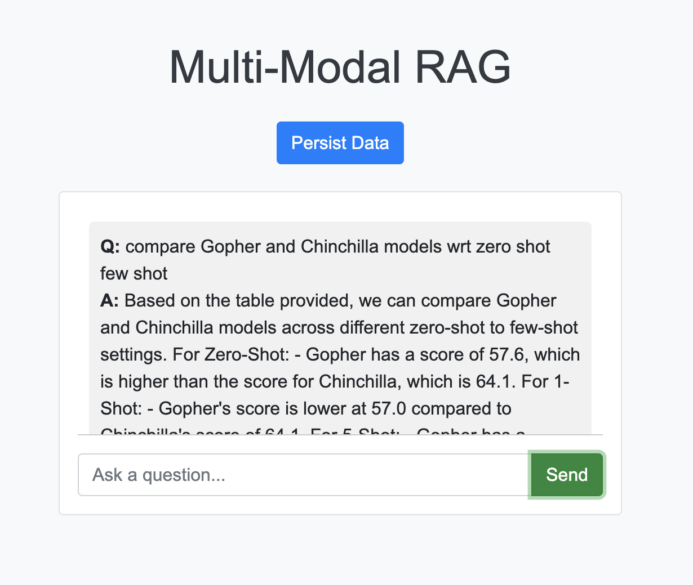

# MultiModal-RAG

## Table of Contents

1. [Introduction](#introduction)
2. [Architecture](#architecture)
3. [Modules](#modules)
    - [PdfHandler](#pdfhandler)
    - [LlamaHandler](#llamahandler)
4. [Installation](#installation)
5. [Usage](#usage)
6. [Running the Application](#running-the-application)
7. [Evaluations](#evaluations)

## Introduction

This project is designed to extract and process data from PDF files, including both text and tables. The processed data is stored in vector databases, allowing for efficient retrieval and multi-modal question-answering using large language models (LLMs).

## Architecture

The architecture of the project consists of three main engines:

### Persistence Engine

1. **PDF Files**: The process starts with the input PDF files.
2. **PDF to Images**: Each page of the PDF is converted into an image.
3. **Table Transformer**: Tables are detected and extracted from the images using a table transformer model.
4. **all-mpnet Model**: Text data is embedded using the all-mpnet model, creating a representation of the textual data.
5. **CLIP Model**: Images are embedded using the CLIP model, creating a representation of the visual data.
6. **Text Store & Image Store**: The embeddings are stored in respective vector databases for text and images.

### Retrieval Engine

1. **Query**: The user provides a query.
2. **all-mpnet Model**: The query is embedded using the all-mpnet model.
3. **Vector Search (Text)**: A search is conducted in the text store to retrieve the top K relevant text embeddings.
4. **CLIP Model**: The query is also embedded using the CLIP model.
5. **Vector Search (Image)**: A search is conducted in the image store to retrieve the top K relevant image embeddings.

### Answer Engine

1. **Prompt Formation**: The retrieved text and image data are combined to form a prompt.
2. **LLaVA Multi-Modal LLM**: The prompt is processed using the LLaVA Multi-Modal LLM to generate an answer.
3. **Answer**: The final answer is returned to the user.


## Project Structure
```
├── app.py
├── data
│   ├── images
│   ├── index
│   ├── pdf
│   ├── readme_images
│   ├── table_images
├── notebooks
│   ├── test.ipynb
├── src
│   ├── config
│   │   ├── config.py
│   ├── llama_handler
│   │   ├── llama_handler.py
│   ├── pdf_handler
│   │   ├── pdf_handler.py
│   ├── prompts
│   │   ├── prompts.py
│   ├── utils
│   │   ├── table_transformer.py
│   │   ├── utils.py
├── static
│   ├── styles.css
├── templates
│   ├── index.html
├── evaluations
│   ├── test_cases.csv
│   ├── evaluation_results.csv
│   ├── evaluation_results_only_image.csv
│   ├── evaluation_results_only_text.csv
│   ├── generate_results.py
│   ├── ragas_evaluate.py
│   ├── results.csv
│   ├── results_only_image.csv
│   ├── results_only_text.csv
├── requirements.txt
├── README.md
```

## Modules

### PdfHandler

The `PdfHandler` class is responsible for processing PDF files. It performs the following tasks:
- Lists all PDF files in the specified directory.
- Converts each page of the PDFs into images.
- Extracts tables from these images using the table transformer model.
- Deletes existing processed folders before starting new processing.

### LlamaHandler

The `LlamaHandler` class handles the embedding and retrieval of data, as well as generating answers using LLMs. It performs the following tasks:
- Embeds text and images using pre-trained models.
- Stores embeddings in vector databases.
- Retrieves relevant data based on a query.
- Generates context for the answer engine.
- Uses LLaVA Multi-Modal LLM to provide answers.

## Installation

### Dependencies 

To install the necessary dependencies, run:

```bash
pip install -r requirements.txt
```

### Ollama Setup 

Download Ollama from here [Ollama](https://ollama.com/)

Run the following code after installing Ollama 

```bash
ollama run llava
```


## Usage

### Running the Application

To start the Flask application, run:

```bash
python app.py
```

Navigate to http://localhost:5000 in your web browser to access the application.

### Processing PDFs

Add Pdf files at this location ./data/pdf

To process the PDFs and persist the data, send a POST request to the `/persist` endpoint:

```bash
curl -X POST http://localhost:5000/persist
```

### Asking Questions

To ask a question and receive an answer, send a POST request to the /answer endpoint with the question in the request body

```bash
curl -X POST -H "Content-Type: application/json" -d '{"question": "Your question here"}' http://localhost:5000/answer
```

### UI 

This how the interactive UI looks



## Evaluations

* Tested on [3 samples](evaluations/test_cases.csv)

### RAGAS

RAGAS (Retrieval-Augmented Generation Answer Scorer) is a framework used to evaluate the quality of answers generated by large language models (LLMs) in a multi-modal retrieval-augmented generation (RAG) system. In a RAG setup, the LLM retrieves relevant information from a knowledge base (e.g., vector databases, documents) to generate more accurate and contextually relevant responses. RAGAS focuses on scoring these generated answers to ensure they meet specific quality criteria

### Evaluation Results with Both Text and Image as Context

The evaluation results when using both text and image as context are as follows:

| Metric                   | Value    |
|--------------------------|----------|
| Faithfulness             | 0.333333 |
| Answer Relevancy         | 0.235039 |
| Context Precision        | 0.166667 |
| Context Recall           | NaN      |
| Context Entity Recall    | 0.162698 |
| Answer Similarity        | 0.551426 |
| Answer Correctness       | 0.137856 |

### Evaluation Results with Only Text as Context

The evaluation results when using only text as context are as follows:

| Metric                   | Value    |
|--------------------------|----------|
| Faithfulness             | 0.511111 |
| Answer Relevancy         | 0.505301 |
| Context Precision        | 0.000000 |
| Context Recall           | NaN      |
| Context Entity Recall    | 0.118581 |
| Answer Similarity        | 0.639318 |
| Answer Correctness       | 0.159829 |

### Evaluation Results with Only Image as Context

The evaluation results when using only image as context are as follows:

| Metric                   | Value    |
|--------------------------|----------|
| Faithfulness             | 0.375000 |
| Answer Relevancy         | 0.159792 |
| Context Precision        | 0.000000 |
| Context Recall           | NaN      |
| Context Entity Recall    | 0.152778 |
| Answer Similarity        | 0.499295 |
| Answer Correctness       | 0.124824 |

### Metric Definitions

#### Faithfulness
**Definition**: Measures how accurately the generated answer reflects the content of the provided context. A higher value indicates that the answer is more directly supported by the context.

#### Answer Relevancy
**Definition**: Assesses how relevant the generated answer is to the question asked. It considers whether the answer addresses the key aspects of the question.

#### Context Precision
**Definition**: Measures the proportion of the context used that is actually relevant to the answer. It evaluates the accuracy of the retrieved context in supporting the answer.

#### Context Recall
**Definition**: Measures how much of the relevant context is retrieved. A higher value means more of the relevant information was included in the context.

#### Context Entity Recall
**Definition**: Evaluates how well the retrieved context covers the entities mentioned in the question and answer. It assesses the completeness of the context in terms of relevant entities.

#### Answer Similarity
**Definition**: Measures how similar the generated answer is to a reference or correct answer. It considers the overlap and similarity in wording and meaning.

#### Answer Correctness
**Definition**: Evaluates the overall correctness of the generated answer in relation to the question and the context provided. It assesses the factual accuracy and completeness of the answer.

### Final Interpretation

- Using both text and image as context provides a balance but shows room for improvement in faithfulness, answer relevancy, and context precision.
- Using only text as context yields the highest faithfulness and answer relevancy, indicating that CLIP model is not working as effectively on current tables
- Using only image as context results in lower performance across most metrics
- Overall, combining text and image can potentially leverage the strengths of both modalities, but there is a need to enhance the integration and processing of multi-modal data to achieve better evaluation metrics.